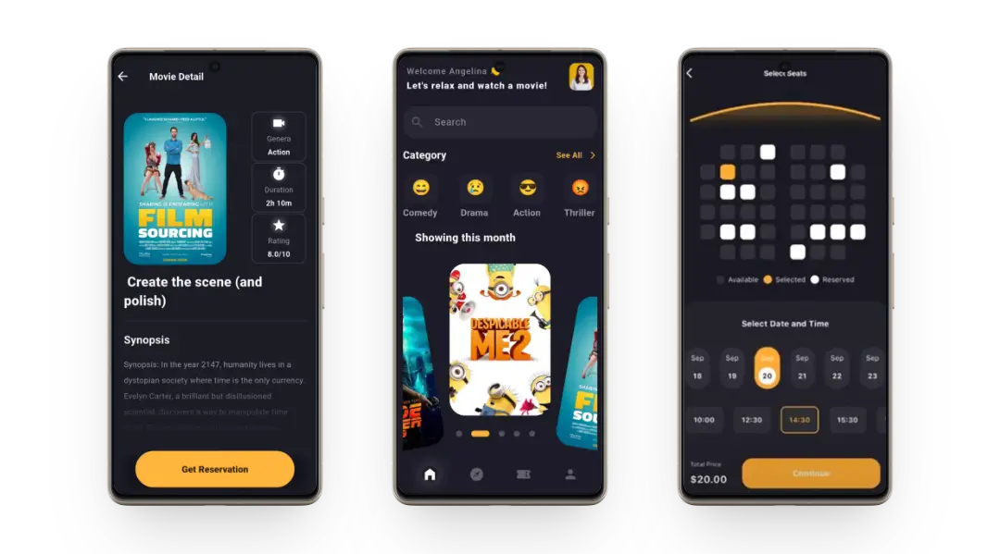
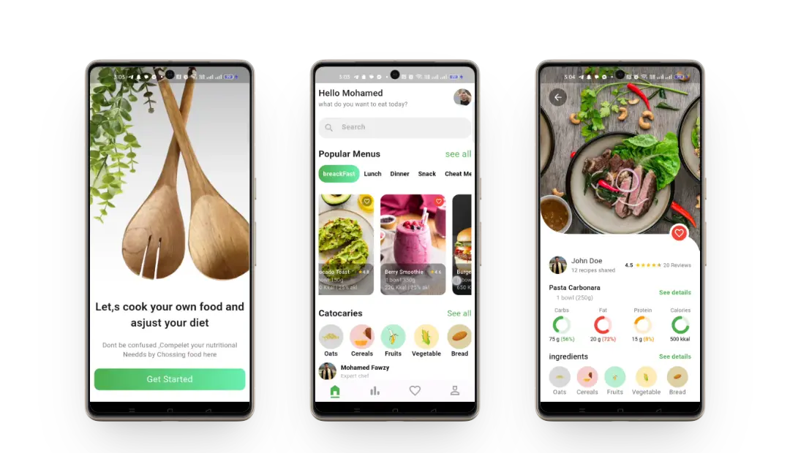
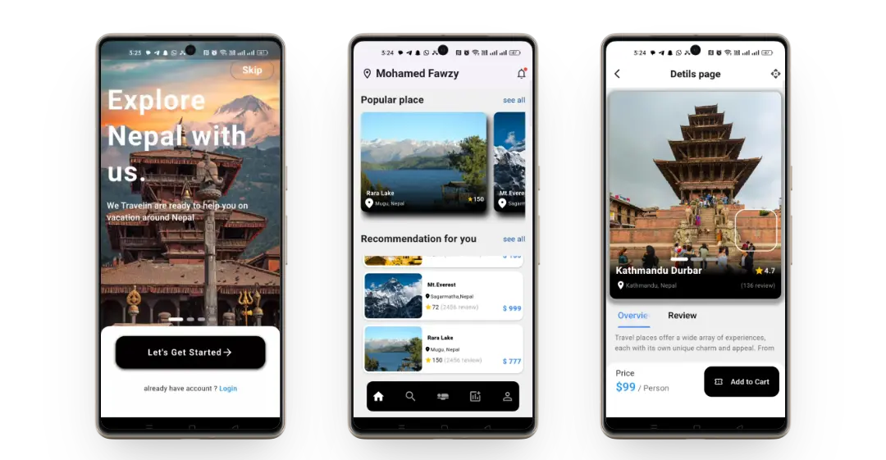
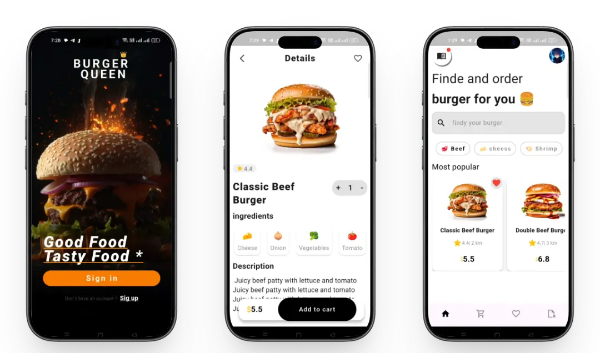

# 🎨 Flutter UI Showcase

A collection of **4 modern Flutter UI projects** built to demonstrate **clean design, smooth layouts, and professional UI/UX implementation**.  
This repository focuses entirely on **high-quality UI**, visual consistency, and performance — without backend integration.

## 📌 Overview

This project includes **four independent Flutter UI applications**:

- 🍲 **Recipe App** – Clean food cards, categories layout, and smooth scrolling  
- 🍔 **Burger App** – Modern fast-food UI with product cards and pricing  
- 🎬 **Cinema App** – Movie listing UI with immersive visuals  
- ✈️ **Travel App** – Travel destinations UI with modern layouts and hero sections  

Each project was built with a strong focus on **layout accuracy, spacing, typography, and responsive design**.

## 📸 Screenshots
 

  

  

  

  

## 🎯 UI Focus
- Professional spacing & alignment  
- Clean typography hierarchy  
- Modern card-based layouts  
- Responsive UI for different screen sizes  
- Smooth user interactions  

## 🔄 State Handling
- Lightweight state handling using **ValueNotifier & ValueListenableBuilder**  
- Efficient for UI-only updates  
- No heavy state management or assets management used  

## 🛠 Tech Stack
- **Flutter**
- **Dart**
- **Material UI**
- **ValueNotifier**
- Reusable custom widgets  

## ⚡ Performance
- Optimized widget rebuilds  
- Smooth scrolling without UI lag  
- Clean and lightweight widget tree  

## 🎯 Purpose
Built mainly to:
- Improve Flutter UI/UX skills  
- Practice professional layout implementation  
- Create portfolio-ready UI projects  

## 📄 License
Open source — free to use for learning and inspiration.